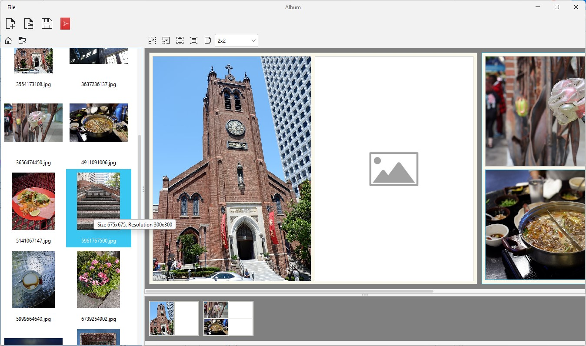

The album project is a desktop application that allows the creation of PDF photo albums. 
The album is created by adding pages which contain placeholders for folders. Images can be 
dropped into the placeholders where they can zoomed/resized. The album can then be exported
as a PDF.

